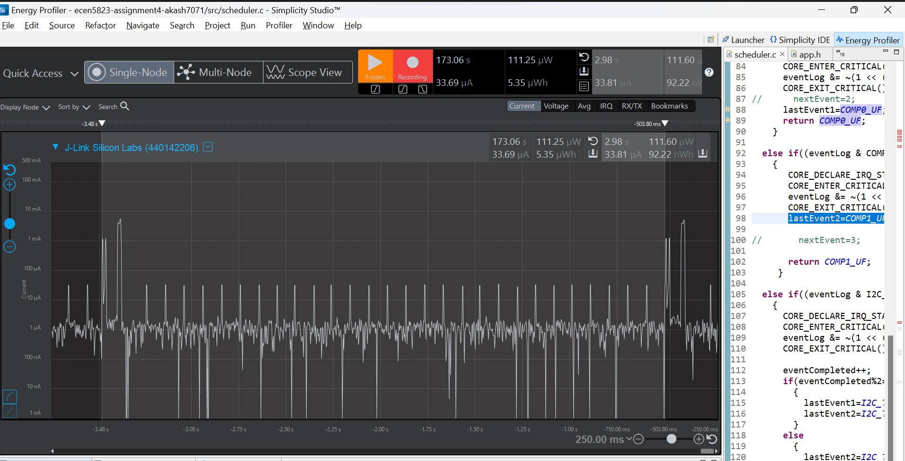
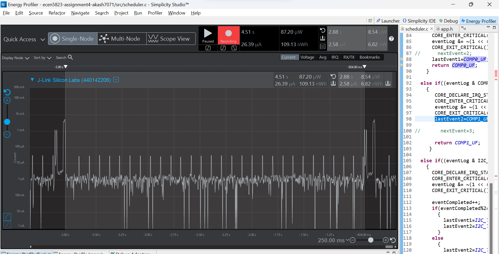
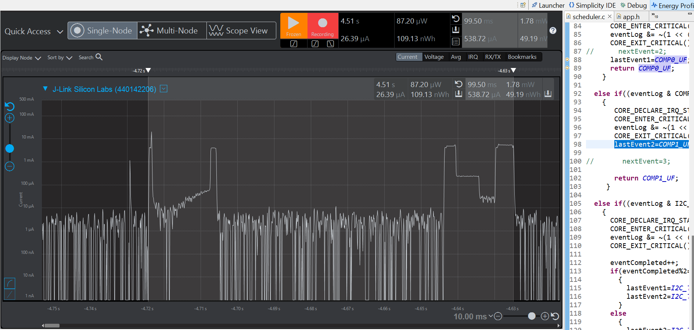

Please include your answers to the questions below with your submission, entering into the space below each question
See [Mastering Markdown](https://guides.github.com/features/mastering-markdown/) for github markdown formatting if desired.

*Be sure to take measurements with logging disabled to ensure your logging logic is not impacting current/time measurements.*

*Please include screenshots of the profiler window detailing each current measurement captured.  See the file Instructions to add screenshots in assignment.docx in the ECEN 5823 Student Public Folder.* 

1. What is the average current per period?
   Answer:
   33.8ua
    Screenshot:  
     

2. What is the average current when the Si7021 is Powered Off?
   Answer:
   2.58ua
    Screenshot:  
     

3. What is the average current when the Si7021 is Powered On?
   Answer:
   538.72ua
    Screenshot:  
     

4. How long is the Si7021 Powered On for 1 temperature reading?
   Answer:
   99.5ms
    Screenshot:  
     

5. Compute what the total operating time of your design for assignment 4 would be in hours, assuming a 1000mAh battery power supply?
   Answer:
   Should last around 29585 Hrs
   (10*1Ah)/33.81uA=29585 Hrs.
   
6. How has the power consumption performance of your design changed since the previous assignment?
   Answer:
   Total time the sensor is on has reduced significantly from 355ms to 98ms. 
   Average current when sensor is powered on has reduced significantly from 4.69ma to 538ua.
   Average current over one period has reduced from 587ua to 33.8ua.
   Average current when the Si7021 is Powered Off has remained about the same from 2.4ua to 2.5ua in irq mode.
   
7. Describe how you tested your code for EM1 during I2C transfers.
   Answer:  
   First, adding power requirements made sure the CPU did not go below EM1 during I2C transfers. The same can be verified from the energy profile window where the current consumption during I2C transfers was much higher than when we are waiting for COMP1 interrupt. 
   Additionally, removing the power manager requirements for I2C transfers show us that the CPU does not complete the I2C transfer as the CPU goes to EM3 mode, leaving the I2C communications off. Hence we do not obtain any temperature reading as the I2C_IRQ throws up transfer error in form of a Nack.

